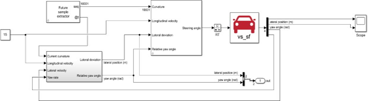
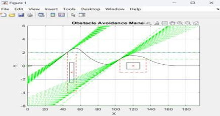
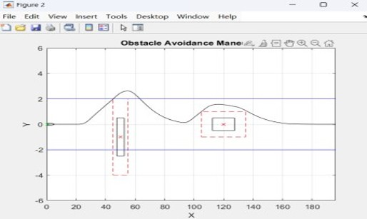
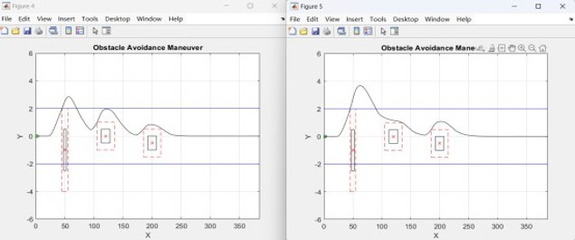
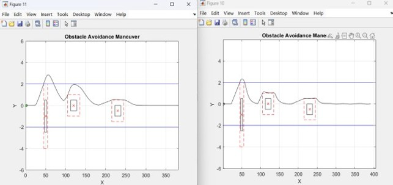
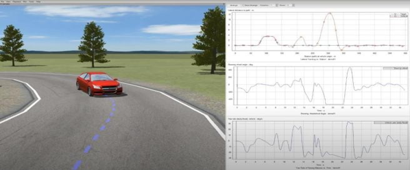

w# MPC Virtual Lab (模型預測控制虛擬實驗室)

[English Version](#english-version) | [Original MathWorks README](README_official.md)

## 專案簡介 (Project Overview)
參與「汽車避障控制之模型預測控制(MPC)應用」專題研究，負責建立精確的車輛動力學模型，並使用 MATLAB/Simulink 與 CARSIM 建構模擬環境，設計與優化 MPC 控制器，調整成本函數與權重以平衡穩定性與反應速度。在專題中，我整合障礙物檢測與避障策略，進行多場景數值模擬與性能評估，成功驗證控制器在動態交通環境下的高穩定性與可靠性。這段經驗讓我不僅熟悉系統建模、數值分析與軟硬體整合流程。

**專題摘要：**
汽車避障 MPC 使用 MATLAB/Simulink 與 CARSIM 建立車輛避障模擬環境，設計模型預測控制器（MPC）並加入障礙物距離判斷與避障路徑規劃。透過比較不同取樣週期與轉向角度限制，分析控制器對車輛軌跡平滑度、反應速度與穩定性的影響。

## 核心功能與實作重點 (Core Features & Implementations)
- **車輛橫向動態建模 (Lateral Vehicle Dynamics Modeling)**：理解並建立車輛轉向控制系統的數學模型。
- **線性模型預測控制 (Linear MPC Design)**：設計並調整線性 MPC 控制器，以達到穩定且精確的車輛軌跡追蹤。
- **自適應模型預測控制 (Adaptive MPC Design)**：針對非線性與時變的車輛動態，設計自適應 MPC 控制器，提升系統在不同運行速度與條件下的強健性 (Robustness)。
- **自訂軌跡設計與追蹤 (Custom Trajectory Tracking)**：實作並驗證控制系統對於複雜路徑的追蹤表現。

## 詳細實作成果與分析 (Detailed Implementation & Analysis)

### 1. MATLAB/Simulink Block 架構
此圖1為專題中的 Simulink block diagram，包含路徑/曲率輸入、MPC 控制器、CARSIM 車輛模型與 Scope 輸出。
**重點**：能呈現我有把控制器、車輛模型與回授訊號串成閉迴路架構。

### 2. 避障路徑規劃與可行軌跡
黑線為車輛規劃後的行駛軌跡，藍線為道路邊界，紅色框為障礙物與安全區。
此圖2呈現車輛在道路邊界內繞過障礙物，並逐步回到預期路徑。

### 3. 障礙物安全距離與避障結果
紅色虛線框表示障礙物緩衝區，黑線為避障後路徑。
系統以車輛與障礙物距離作為判斷條件，當距離低於安全門檻時觸發避障策略。

### 4. 不同取樣週期對軌跡的影響
比較不同取樣週期下，MPC 控制器對路徑變化的反應。
較短取樣週期通常能讓控制器更快回應，軌跡較平滑；取樣週期較長時，較容易產生延遲與偏移。

### 5. 不同轉向角度限制對避障穩定性的影響
比較不同轉向角限制下的避障軌跡。
轉向角限制會影響車輛避障時的靈活性與穩定性；限制過大可能造成軌跡震盪或不穩定。

### 6. 在 CARSIM 上模擬
左側為車輛道路模擬畫面，右側為車輛狀態輸出曲線。
可觀察橫向位置、轉向角與偏航相關訊號，作為判斷車輛穩定性與控制效果的依據。

## 專案結構 (Project Structure)
- `simulink_models/`：包含設計與測試用的 Simulink 模型 (例如 `Linear_MPC_design.slxc`)。
- `scripts/`：包含輔助分析與資料處理的 MATLAB 腳本。
- `MPC virtual lab/`：主要的互動式 MATLAB Live Scripts，記錄詳細的實驗過程。
- `README_official.md`：保留原版的 MathWorks 官方操作說明與授權資訊。

---

# English Version

## Project Overview
Participated in the "Model Predictive Control (MPC) Application for Vehicle Obstacle Avoidance" research project. Responsible for building precise vehicle dynamics models and constructing a simulation environment using MATLAB/Simulink and CARSIM. Designed and optimized the MPC controller, adjusting cost functions and weights to balance stability and response speed. Integrated obstacle detection and avoidance strategies, conducted multi-scenario numerical simulations, and evaluated performance, successfully validating the controller's high stability and reliability in dynamic traffic environments. This experience provided deep familiarity with system modeling, numerical analysis, and hardware-software integration workflows.

**Project Summary:**
The vehicle obstacle avoidance MPC project utilizes MATLAB/Simulink and CARSIM to build a simulation environment. It involves designing a Model Predictive Controller (MPC) incorporating obstacle distance judgment and path planning. By comparing different sampling times and steering angle limits, it analyzes the controller's impact on vehicle trajectory smoothness, response speed, and stability.

## Core Features & Implementations
- **Lateral Vehicle Dynamics Modeling**: Modeling and simulating mathematical models for vehicle steering control systems.
- **Linear MPC Design**: Designing and tuning a linear MPC controller to achieve stable and precise vehicle trajectory tracking.
- **Adaptive MPC Design**: Designing an adaptive MPC controller to handle non-linear and time-varying vehicle dynamics, enhancing system robustness under different operating speeds and conditions.
- **Custom Trajectory Tracking**: Implementing and verifying the control system's performance on tracking complex custom paths.

## Detailed Implementation & Analysis

### 1. MATLAB/Simulink Block Architecture
This is the Simulink block diagram for the project, including path/curvature inputs, the MPC controller, the CARSIM vehicle model, and Scope outputs.
**Key Focus**: Demonstrates the closed-loop architecture integrating the controller, vehicle model, and feedback signals.

### 2. Obstacle Avoidance Path Planning & Feasible Trajectory
The black line is the planned vehicle trajectory, the blue lines are the road boundaries, and the red box represents the obstacle and safety zone.
Shows the vehicle bypassing the obstacle within road boundaries and gradually returning to the expected path.

### 3. Obstacle Safety Distance & Avoidance Results
The red dashed box indicates the obstacle buffer zone, and the black line is the path after avoidance.
The system uses the distance between the vehicle and the obstacle as a condition, triggering the avoidance strategy when the distance falls below a safety threshold.

### 4. Impact of Sampling Time on Trajectory
Compares the MPC controller's response to path changes under different sampling times.
A shorter sampling time usually allows the controller to respond faster, resulting in a smoother trajectory. A longer sampling time is more prone to delays and offsets.

### 5. Impact of Steering Angle Limits on Avoidance Stability
Compares avoidance trajectories under different steering angle limits.
Steering angle limits affect the vehicle's flexibility and stability during avoidance; overly loose limits may cause trajectory oscillation or instability.

### 6. CARSIM Simulation
The left side shows the vehicle road simulation, and the right side displays the vehicle state output curves.
Lateral position, steering angle, and yaw signals can be observed as a basis for judging vehicle stability and control effectiveness.

## Project Structure
- `simulink_models/`: Contains the Simulink models used for design and testing (e.g., `Linear_MPC_design.slxc`).
- `scripts/`: Contains MATLAB scripts for auxiliary analysis and data processing.
- `MPC virtual lab/`: The main interactive MATLAB Live Scripts documenting the experimental process.
- `README_official.md`: The original MathWorks documentation containing detailed setup instructions and license information.
