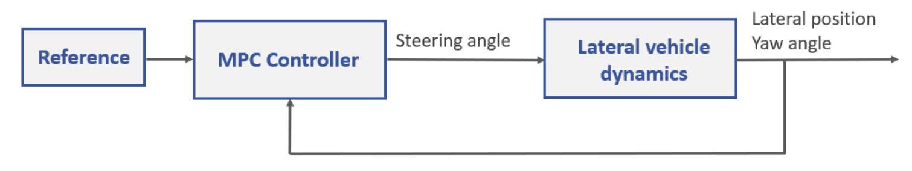
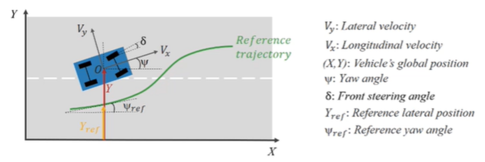

# MPC Virtual Lab (模型預測控制虛擬實驗室)

[English Version](#english-version) | [Original MathWorks README](README_official.md)

## 專案簡介 (Project Overview)
本專案為學術申請與展示用途，基於 MathWorks 官方的 MPC (Model Predictive Control) 虛擬實驗室進行實作。本專案展示了現代控制系統理論的應用，以及使用 MATLAB, Simulink 與 CARSIM 進行系統建模與控制器設計的能力。

## 核心功能與實作重點 (Core Features & Implementations)
- **車輛橫向動態建模 (Lateral Vehicle Dynamics Modeling)**：理解並建立車輛轉向控制系統的數學模型。
- **線性模型預測控制 (Linear MPC Design)**：設計並調整線性 MPC 控制器，以達到穩定且精確的車輛軌跡追蹤。
- **自適應模型預測控制 (Adaptive MPC Design)**：針對非線性與時變的車輛動態，設計自適應 MPC 控制器，提升系統在不同運行速度與條件下的強健性 (Robustness)。
- **自訂軌跡設計與追蹤 (Custom Trajectory Tracking)**：實作並驗證控制系統對於複雜路徑的追蹤表現。

## 詳細實作成果與分析 (Detailed Implementation & Analysis)

| 實作項目 (Implementation) | 說明與重點 (Description) |
| :--- | :--- |
| **MATLAB/Simulink 閉迴路架構 (Closed-Loop Architecture)** | 整合路徑/曲率輸入、MPC 控制器、CARSIM 車輛模型與 Scope 輸出。**重點**：成功將控制器、車輛模型與回授訊號串聯，完成完整的閉迴路架構。 |
| **避障路徑規劃與可行軌跡 (Obstacle Avoidance Trajectory)** | 模擬車輛在道路邊界內繞過障礙物，並逐步回到預期路徑。（黑線：行駛軌跡 / 藍線：道路邊界 / 紅框：障礙物與安全區） |
| **障礙物安全距離與避障結果 (Safety Distance & Avoidance)** | 系統以車輛與障礙物距離作為判斷條件，當距離低於安全門檻時，即自動觸發避障策略。 |
| **取樣週期對軌跡的影響 (Impact of Sampling Time)** | 比較不同取樣週期對 MPC 控制器反應的影響：較短取樣週期反應較快且軌跡平滑；較長取樣週期則易產生延遲與偏移。 |
| **轉向角限制對穩定性的影響 (Impact of Steering Limits)** | 探討不同轉向角限制下的避障表現。轉向角限制直接影響靈活性與穩定性，限制過大可能導致軌跡震盪或不穩定。 |
| **CARSIM 軟體整合模擬 (CARSIM Integration Simulation)** | 結合 CARSIM 進行車輛道路模擬，並透過輸出橫向位置、轉向角與偏航角等狀態曲線，作為判斷車輛穩定性與控制效果的依據。 |

## 系統展示 (System Visuals)
> **(💡提示：如果您有將上述提到的圖表截圖存檔，可以將圖片放入資料夾並將檔名替換到下方)**

## 專案結構 (Project Structure)
- `simulink_models/`：包含設計與測試用的 Simulink 模型 (例如 `Linear_MPC_design.slxc`)。
- `scripts/`：包含輔助分析與資料處理的 MATLAB 腳本。
- `MPC virtual lab/`：主要的互動式 MATLAB Live Scripts，記錄詳細的實驗過程。
- `README_official.md`：保留原版的 MathWorks 官方操作說明與授權資訊。

---

# English Version

## Project Overview
This repository is prepared for academic portfolio and demonstration purposes, based on the official MathWorks MPC (Model Predictive Control) Virtual Lab. It showcases the practical application of modern control theory and the ability to perform system modeling and controller design using MATLAB, Simulink, and CARSIM.

## Core Features & Implementations
- **Lateral Vehicle Dynamics Modeling**: Modeling and simulating mathematical models for vehicle steering control systems.
- **Linear MPC Design**: Designing and tuning a linear MPC controller to achieve stable and precise vehicle trajectory tracking.
- **Adaptive MPC Design**: Designing an adaptive MPC controller to handle non-linear and time-varying vehicle dynamics, enhancing system robustness under different operating speeds and conditions.
- **Custom Trajectory Tracking**: Implementing and verifying the control system's performance on tracking complex custom paths.

## Detailed Implementation & Analysis

| Implementation | Description & Key Findings |
| :--- | :--- |
| **Closed-Loop Architecture (MATLAB/Simulink)** | Integrated path/curvature inputs, MPC controller, CARSIM vehicle model, and Scope outputs. **Key**: Successfully formed a complete closed-loop architecture with feedback signals. |
| **Obstacle Avoidance Trajectory** | Simulated the vehicle bypassing an obstacle within road boundaries and gradually returning to the expected path. |
| **Safety Distance & Avoidance** | The system uses the distance between the vehicle and the obstacle as a condition to automatically trigger the avoidance strategy when below a safety threshold. |
| **Impact of Sampling Time** | Compared MPC controller responses: Shorter sampling times yield faster responses and smoother trajectories, while longer times are prone to delays and offsets. |
| **Impact of Steering Limits** | Analyzed obstacle avoidance under different steering angle limits. Limits directly affect flexibility and stability; overly loose limits may cause trajectory oscillation or instability. |
| **CARSIM Integration Simulation** | Conducted 3D road simulations combined with CARSIM, outputting state curves like lateral position, steering angle, and yaw to evaluate vehicle stability and control effectiveness. |

## System Visuals
> **(💡Note: Replace the image sources below with your actual exported charts from the simulation if available)**

## Project Structure
- `simulink_models/`: Contains the Simulink models used for design and testing (e.g., `Linear_MPC_design.slxc`).
- `scripts/`: Contains MATLAB scripts for auxiliary analysis and data processing.
- `MPC virtual lab/`: The main interactive MATLAB Live Scripts documenting the experimental process.
- `README_official.md`: The original MathWorks documentation containing detailed setup instructions and license information.
